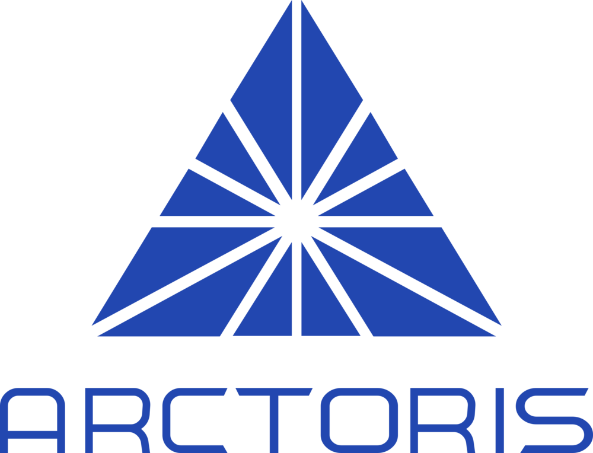

  

-----------------------------------------------------------------------------

# R Pipelines Data

## Table of Content
* [Introduction](#introduction)
* [Features](#features)
* [Tecnology](#tecnology)
* [Contact](#contact)

## Introduction

This repository project has the objective of store all the data produced by the Arctoris R Pipelines. Each folder has the input and output data of the respective experiment  

## Features

The repository has data from the following experiments:

* BiochemQC
* Mpro
* pCRC
* CTG

-----------------------------------------------------------------------------

  

### GitLab Orange Heading
{: .gitlab-orange}

- **Bold**
- _italics_
- ~~Strike through~~

## General info
This project is simple Lorem ipsum dolor generator.

## Technologies

asdasda

## um test

asdasd

### Testtt:

#### agagav

This project is part of the recruitment for the Appsilon Shiny Developer job position.

This repository contains the files used to create the Marine Shiny App. The App illustrates the longest distance between two consecutive observations for multiple ships.

Furthermore, this repository has the R code used to refine the raw dataset provided "ships.csv" and create the clean dataset "ShipsAppData.csv" used in the App. Furthermore, this repository also contains the image used in the App and the R code that reproduces the report.

You can access the Marine Shiny App using the following link: 

https://henrique-meira-de-oliveira.shinyapps.io/MarineApp/
